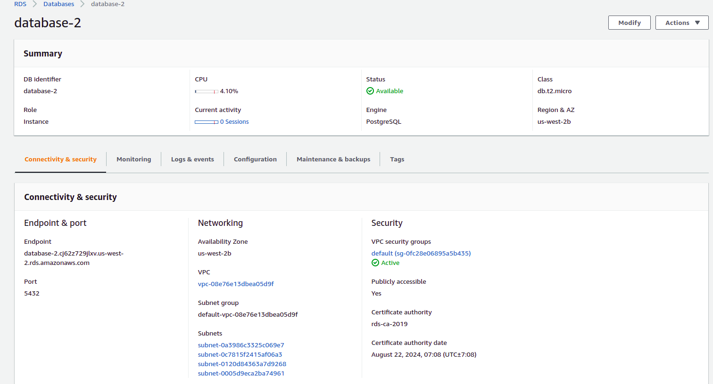
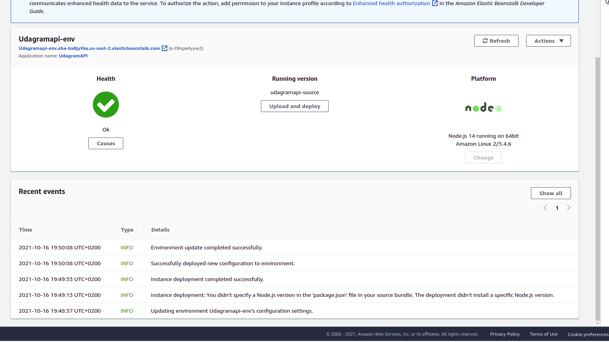
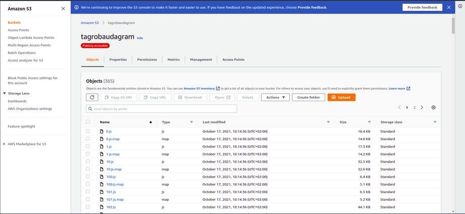
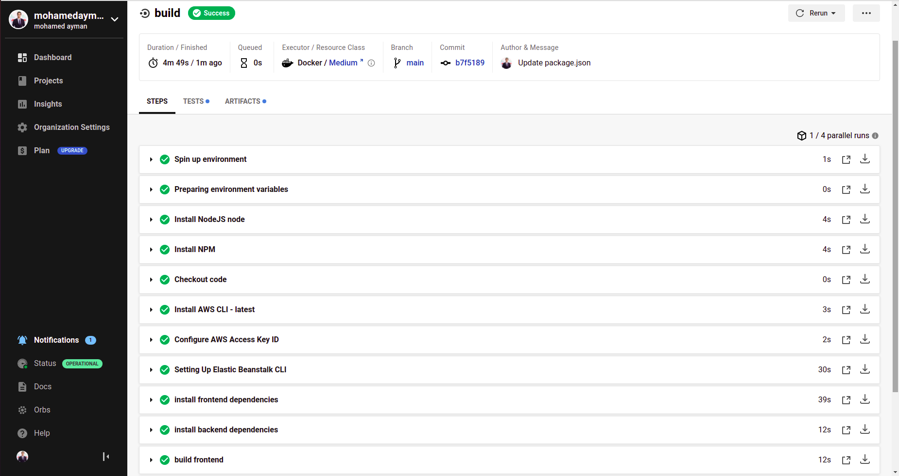
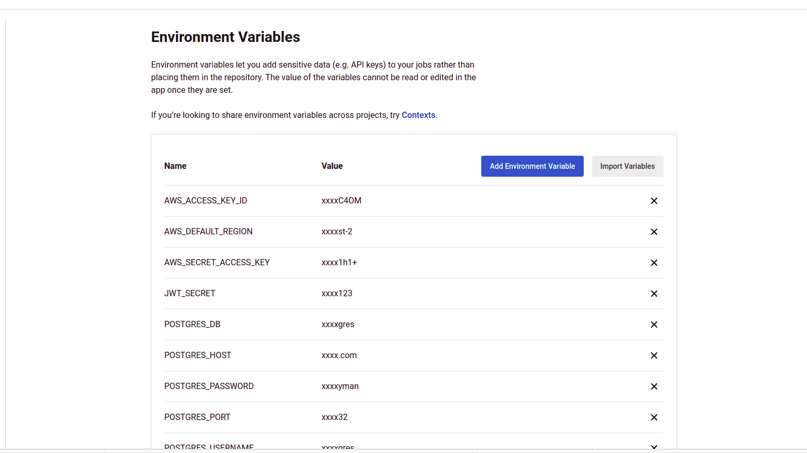
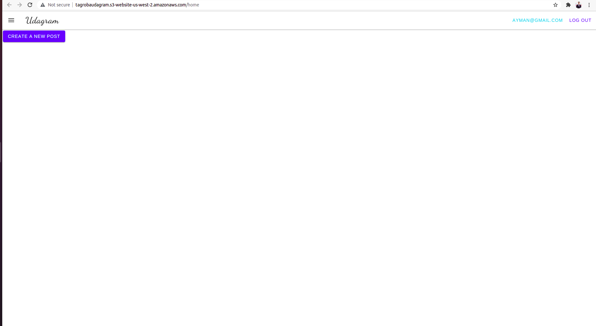
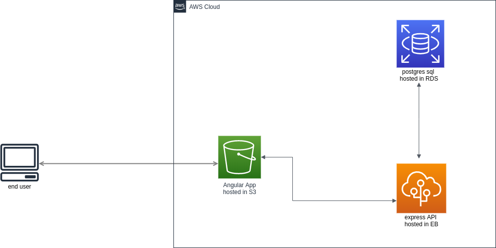

# Udagram

This project is part of the Udacity FullStack JavaScript nanodegree. the code was written by udacity and my task was to deploy this full stack application.

you can check the application here:
http://finaludagram.s3-website.us-east-2.amazonaws.com

* RDS for postgres database 

* Elastic Beanstalk for API deployment

* S3 Bucket for frontend deployment

* I created a pipeline using CircleCI

* CircleCI environment

* the application after deployment

## Dependencies

- Node
- Angular
- Express
- AWS

## infrastructure

AWS EB for API deployment
AWS S3 for frontend deployment
AWS RDS for the database

## pipeline

1- install dependencies
2- build backend and frontend
3- deploy backend and frontend

